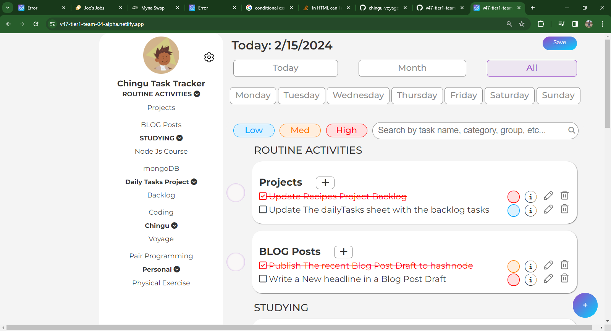

# [Chingu Voyage 47 - Tier 1 - Daily Tasks Manager](https://github.com/chingu-voyages/v47-tier1-team-04)

## Table of contents

- [Overview](#overview)
  - [The Project](#the-project)
  - [Screenshot](#screenshot)
  - [Links](#links)
- [General Instructions](#general-instructions)
  - [Built with](#built-with)
  - [Getting Started](#getting-started)
  - [Prerequisites](#prerequisites)
  - [Installing](#installing)
  - [Deployment](#deployment)
- [Authors](#authors)
- [Acknowledgments](#acknowledgments)
- [About Chingu](#about-chingu)
- [Contact Us](#contact-us)

## Overview

Chingu brings together a number of individuals with a goal to develop a web application within a six-week "voyage". In this Voyage, we had a team of seven, including a user experience designer and a product owner. Our task was to develop a web application that helps users organize and manage tasks effectively on a day-to-day basis.

### The Project

The Minimum Viable Product of this application should allow users to create tasks and assign them a date, priority, frequency, and track their completion. Users should also be able to delete or update tasks. Initially, a dataset is provided to the team, which should be parsed and displayed in an interface that allows users to sort by category, activity type, and individual tasks.

#### Example Image


This project provides a valuable opportunity for us to gain hands-on experience in web development while working with multi-dimensional datasets. It serves as a practical application to hone our skills and delve into the complexities of data manipulation within a web-based environment.

### Screenshot



### Links

- [Repository](https://github.com/chingu-voyages/v47-tier1-team-04)
- [Documentation](https://chingu-voyages.github.io/v47-tier1-team-04/)
- [Live Site URL](https://v47-tier1-team-04.netlify.app/)
- [Development URL](https://v47-tier1-team-04-dev.netlify.app/)
- [Beta Testing URL](https://v47-tier1-team-04-beta.netlify.app/)
- [Alpha Testing URL](https://v47-tier1-team-04-alpha.netlify.app/)

### Built with

- [Figma](https://www.figma.com/proto/2meMrjvZwr4FjPYGJsxryo/Chingu-Voyage-47?node-id=91-34&starting-point-node-id=91%3A34&show-proto-sidebar=1&mode=design&t=V6RzzKbhLvmLFLsz-1)
- [HTML: HyperText Markup Language](https://developer.mozilla.org/en-US/docs/Web/HTML)
- [CSS: Cascading Style Sheets](https://developer.mozilla.org/en-US/docs/Web/CSS)
- [JavaScript](https://developer.mozilla.org/en-US/docs/Web/javascript)

### Getting started

These instructions will guide you to set up and run the project on your local machine for [development](#developing) and testing purposes. See [deployment](#deployment) for notes on how to deploy the project on a live system.

What things you need to install the software and how to install them.

```
live-server
```
### Installing

Our application is does not use any dependencies for deployment therefore it does not need to be installed. However if you like there is a package.json file which leverages a developer dependency of `live-server`.

To install this developer dependency , use the command `npm i` or `npm install`. Alternatively of course this could be donw with `yarn install` as well.


### Developing
In order to enter a development environment use the command `npm start` or `npm run start`, or alternatively `yarn run start` if used as the package manager.
### Deployment

We do not have a deployment build. To deploy the app on a front-end cloud solution such as Netlify, Vercel, AWS, or etc. simply set the publish directory as `public`. 
## Authors

- **Amanda Libbey** -- _Developer_ - [Amanda-Libbey](https://github.com/Amanda-Libbey)
- **Chingu Voyages** - _Initial work_ - [chingu-voyages](https://github.com/chingu-voyages)
- **egpennington (애멧)** -- _Developer_ - [egpennington](https://github.com/egpennington)
- **jayanti-neu** -- _Developer_ - [jayanti-neu](https://github.com/jayanti-neu)
- **Jim Medlock** - _Initial work_ - [jmedlock](https://github.com/jdmedlock)
- **Mikey Nichols** -- _Product Owner_ - [mnichols08](https://github.com/mnichols08)
- **Stacy Riley** -- _Developer_ - [Stacy-Riley](https://github.com/Stacy-Riley)
- **taswakil** -- _UI/UX Designer_ - [taswakil](https://github.com/taswakil)
- **WillBurroughs** -- _Developer_ - [WillCburroughs](https://github.com/WillCBurroughs)

See also the list of [contributors](./CONTRIBUTORS.md) who participated in this project.

## Acknowledgments
Shout out to [Klesta](https://github.com/klezi10), our wonderful Voyage Guide.

## About Chingu

If you aren’t yet a member of Chingu we invite you to join us. We help our members transform what they’ve learned in courses & tutorials into the practical experience employers need and want.

## Contact Us

Please report any [🐛bug🐛](https://github.com/chingu-voyages/v47-tier1-team-04/issues/new?assignees=&labels=bug&projects=&template=bug-report-template.md). Or, feel free to participate in a discussion!

### Prerequisites

To install and run the software, you will need the following:
What things you need to install the software and how to install them.

```
live-server
```

### Installing

Our application is does not use any dependencies for deployment therefore it does not need to be installed. However if you like there is a package.json file which leverages a developer dependency of `live-server`.

To install this developer dependency , use the command `npm i` or `npm install`. Alternatively of course this could be donw with `yarn install` as well.


### Developing
In order to enter a development environment use the command `npm start` or `npm run start`, or alternatively `yarn run start` if used as the package manager.
### Deployment

We do not have a deployment build. To deploy the app on a front-end cloud solution such as Netlify, Vercel, AWS, or etc. simply set the publish directory as `public`. 
## Authors

- **Amanda Libbey** -- _Developer_ - [Amanda-Libbey](https://github.com/Amanda-Libbey)
- **Chingu Voyages** - _Initial work_ - [chingu-voyages](https://github.com/chingu-voyages)
- **egpennington (애멧)** -- _Developer_ - [egpennington](https://github.com/egpennington)
- **jayanti-neu** -- _Developer_ - [jayanti-neu](https://github.com/jayanti-neu)
- **Jim Medlock** - _Initial work_ - [jmedlock](https://github.com/jdmedlock)
- **Mikey Nichols** -- _Product Owner_ - [mnichols08](https://github.com/mnichols08)
- **Stacy Riley** -- _Developer_ - [Stacy-Riley](https://github.com/Stacy-Riley)
- **taswakil** -- _UI/UX Designer_ - [taswakil](https://github.com/taswakil)
- **WillBurroughs** -- _Developer_ - [WillCburroughs](https://github.com/WillCBurroughs)

See also the list of [contributors](./CONTRIBUTORS.md) who participated in this project.

## Acknowledgments
Shout out to [Klesta](https://github.com/klezi10), our wonderful Voyage Guide.

## About Chingu

If you aren’t yet a member of Chingu we invite you to join us. We help our members transform what they’ve learned in courses & tutorials into the practical experience employers need and want.

## Contact Us

Please report any [🐛bug🐛](https://github.com/chingu-voyages/v47-tier1-team-04/issues/new?assignees=&labels=bug&projects=&template=bug-report-template.md). Or, feel free to participate in a discussion!
